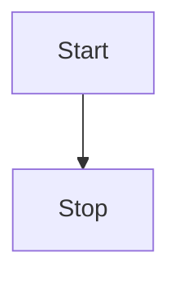

# Kinetra website and user documentation

This is the website and user documentation for the Kinetra project.

## I just want to contribute to the documentation!

Look no further! Just edit the files in the `content/docs` directory and submit a pull request.

The docs are written in GitHub Flavored Markdown (GFM) and processed by Fumadocs.
You can find more information about writing GFM style Markdown in the [Fumadocs documentation](https://fumadocs.dev/docs/ui/markdown).

**Important:** Please use [custom anchors](https://fumadocs.dev/docs/ui/markdown#custom-anchor) for headings to guarantee links stay stable in the future.

Additionally, if you want your documentation to be extra fancy, you can use [Fumadocs components](https://fumadocs.dev/docs/ui/components).

We also added custom components for advanced use cases:

### [Mermaid](https://mermaid.js.org/)

````markdown
# Just write Mermaid code between the ```mermaid tags.


````

## Development

Install [`mise`](https://mise.jdx.dev/):
```bash
# macOS and linux
curl https://mise.run | sh
```

Enable `mise` in your shell, then restart your shell:
```bash
# zsh
echo 'eval "$(mise activate zsh)"' >> ~/.zshrc

# bash
echo 'eval "$(mise activate bash)"' >> ~/.bashrc
```

Trust this project's `mise.toml` and install the configured tools:
```bash
mise trust
mise install
```

Install dependencies with the Bun version managed by `mise`:
```bash
bun install
```

Start the development server:
```bash
bun dev
```

Other useful commands:
```bash
bun run lint
bun run format
bun run build
```
